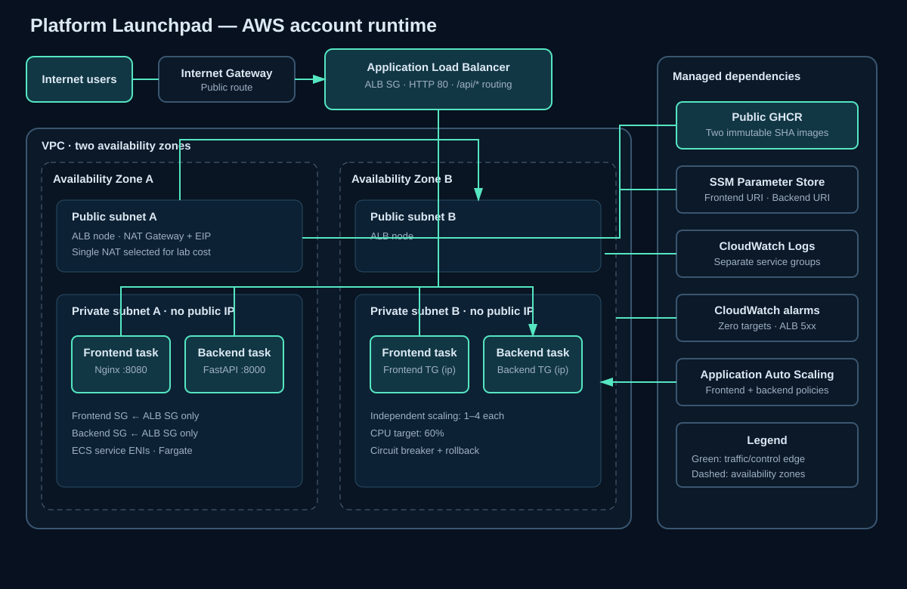

# Platform Launchpad

A complete multi-account AWS reference platform: a polished React/Vite landing page calls a FastAPI service through one Application Load Balancer, while Terraform, Terragrunt, and GitHub Actions deliver immutable public GHCR images to private ECS Fargate services in three accounts.



## What is deployed

- A frontend React/TypeScript build served by unprivileged Nginx on port 8080.
- A backend FastAPI application served by Uvicorn on port 8000.
- One VPC per account spanning two availability zones, with two public and two private subnets.
- One public ALB: `/api/*` forwards to FastAPI; every other route forwards to React.
- Two private Fargate services with no public task IPs and ALB-only ingress.
- Independent 1–4 task autoscaling policies targeting 60% average CPU.
- Short-retention CloudWatch logs, zero-healthy-target alarms, and an ALB 5xx alarm.

The repository uses only `main` and has no pull-request workflows. `build-images.yml` publishes releases and `infrastructure.yml` plans or executes account deployments.

## Repository map

```text
app/frontend                 React, Vite, tests, Nginx image
app/backend                  FastAPI, tests, Uvicorn image
infra/modules                Reusable ECS Fargate Terraform module
infra/live/account-{1,2,3}   Isolated Terragrunt deployments/state keys
.github/workflows            Image publishing and infrastructure deployment workflows
.github/actions              Composite action for shared Terraform, Terragrunt, and AWS setup
scripts                      Local and pipeline test, build, deployment, and validation tools
docs                         Architecture, setup, security, cost, and runbooks
```

## Prerequisites

For local development: Git, Node.js 22, npm, Python 3.13, and optionally Docker, Terraform 1.10+, Terragrunt, TFLint, Checkov, Trivy, Hadolint, ShellCheck, actionlint, jq, and xmllint. For deployment: a GitHub repository, public GHCR packages, three AWS accounts with existing GitHub OIDC roles, and the shared SSE-S3 state bucket created by the local Terraform bootstrap.

## Local development

```bash
make frontend-test
make backend-test
make build-images
make run-local
make terraform-fmt
make terraform-validate
```

The Vite dev server proxies `/api` to `localhost:8000`; Nginx never proxies API traffic in the image. Local testing, formatting, image builds, and offline Terraform validation are supported. Local AWS plan/apply/destroy is not a supported operating path: all AWS mutations must use the infrastructure workflow.

## First-time setup

1. Replace `@GITHUB_OWNER` in `.github/CODEOWNERS`.
2. Run the one-time local Terraform bootstrap to create the shared encrypted, versioned S3 state bucket and role policies; see [remote state](docs/REMOTE_STATE.md).
3. Create one narrowly trusted OIDC role in every target account; see [OIDC and IAM](docs/IAM_OIDC.md).
4. Add the repository variables listed in [variables and secrets](docs/VARIABLES_AND_SECRETS.md).
5. Run **Build immutable images**. After first publication, verify both GHCR packages are public.
6. Run **Infrastructure → apply** and select one account or `all`. Leave the image SHA blank to deploy the latest successful `main` image build, or provide a full 40-character SHA to select a specific release. GitHub Environments are not currently used, so execution continues automatically after planning.

## Delivery

Application changes on `main` run frontend/backend quality checks, build and scan both images, smoke-test them, and publish only full-SHA tags. The output SHA is the deployment identifier; the mutable `latest` tag is explicitly prohibited because it cannot identify the selected artifact.

The manual infrastructure workflow supports:

- `plan`: reads existing image parameters and uploads binary/readable plans without changing SSM or infrastructure.
- `apply`: resolves a blank image input to the latest successful `main` image-build SHA, verifies both public images, temporarily writes both new URIs to create the plan, restores the prior SSM state, then rewrites the selected URIs and applies that exact checksummed binary plan. An explicit SHA remains available for promotion and rollback.
- `destroy`: requires the exact `DESTROY <target>` phrase, creates a destroy plan, and applies that exact plan. Shared state infrastructure and GHCR packages remain.

To deploy one account select its alias. To deploy all accounts select `all`; each matrix member has isolated state, credentials, and results. A partial multi-account failure does not roll back successful accounts.

## Rollback

Run a new `apply` using an earlier known-good image SHA. The workflow verifies both images, updates both SSM references, plans new task definition revisions, and lets ECS roll out the earlier pair. It never performs an automatic Terraform rollback. See [rollback](docs/ROLLBACK.md).

## Outputs

Terragrunt exposes the ALB DNS name/HTTP URL, cluster and service names, VPC ID, and selected image URIs. The workflow smoke-tests `/health` and `/api/health` after apply.

## Security and cost

There are no static AWS credentials. Tasks are private, run as non-root with read-only root filesystems, have separate least-access security groups/roles, and receive immutable images. Public GHCR means image contents are publicly downloadable; task egress reaches GHCR through NAT. Plan artifacts and state can reveal infrastructure details and require restricted repository access/retention.

This architecture is **not guaranteed to fit AWS Free Tier**. Each account continuously runs two Fargate tasks plus an ALB and NAT gateway, and also incurs public IPv4, NAT processing, logs, alarms, state, and transfer charges. Review [costs](docs/COSTS.md) before deploying.

## Known trade-offs

HTTP is used because no domain/certificate was supplied. One NAT gateway reduces lab cost but introduces an AZ dependency. Public GHCR avoids per-account registry credentials but requires NAT internet egress. Desired task count is delegated to autoscaling after initial service creation. ALB access logs, WAF, Container Insights, custom domains, and multi-AZ NAT are deliberately disabled by default.

The documentation index is at [docs/README.md](docs/README.md).
