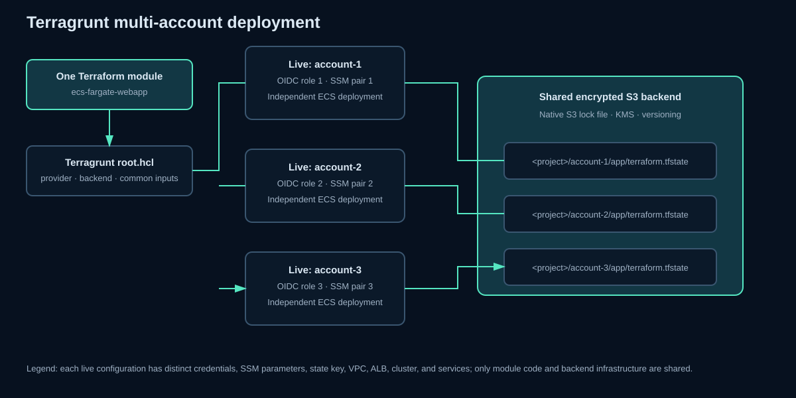

# Multi-account model

`root.hcl` centralizes provider generation, shared S3 backend settings, native S3 locking, parameter paths, and common inputs. Three live configurations select distinct VPC CIDRs and state keys. GitHub supplies a separate account ID, region, and existing OIDC role for each target. Selecting `all` produces a three-member matrix; failures are isolated and successful accounts are not automatically reverted.

Use account aliases only as labels—account IDs never appear in committed configuration. Roll out account 1 first, then expand after validation.

## Planned regional rollout

| Deployment | Region | Rollout status |
|---|---|---|
| `account-1` | `ap-south-1` (Mumbai) | Deploy and validate first |
| `account-2` | `ap-southeast-1` (Singapore) | Hold until account 1 is accepted |
| `account-3` | `eu-west-1` (Ireland) | Hold until account 1 is accepted |

Regions are supplied as GitHub Actions variables rather than committed provider values. This keeps one module reusable while giving every account an explicit deployment location.

