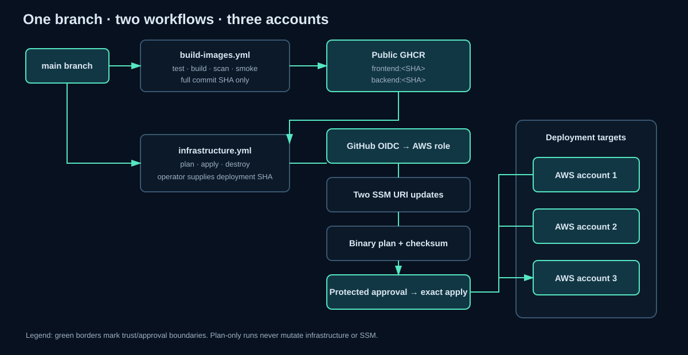

# Pipelines

## Image workflow

Push application change -> frontend checks -> backend checks -> two Buildx images -> Trivy scans -> local container smoke tests -> GHCR login -> push the same full SHA -> verify digests -> metadata artifact and step summary. Documentation-only and Terraform-only changes do not trigger it. A blank infrastructure image input automatically selects the latest successful `main` image workflow SHA; an explicit full SHA selects a release for promotion or rollback.

## Workflow structure

`infrastructure.yml` owns only the manual inputs and calls `reusable-infrastructure.yml`. The reusable workflow owns input validation, account matrices, planning, execution, concurrency, and artifact transfer. The local `setup-infrastructure` composite action performs repeated Terraform, Terragrunt, OIDC, and account-verification steps inside each job. Longer input, SSM, planning, and smoke-test command logic lives in `scripts/infrastructure/` so it remains readable and testable outside the workflow YAML.

## Plan

Manual plan/account -> OIDC -> account verification -> read both existing SSM URIs -> Terragrunt init/plan -> binary plan, checksum, and readable artifact -> no mutation.

## Apply

Manual apply/account/optional SHA -> resolve the release -> verify both public images -> OIDC/account check -> preserve SSM -> temporarily update two URIs -> create exact plan -> restore SSM -> redownload and checksum -> new OIDC/account check -> write selected URIs -> exact-plan apply -> ALB smoke tests.

## Destroy

Manual destroy plus exact phrase -> OIDC/account check -> destroy plan -> checksum/artifact -> exact destroy-plan apply. The state bucket and images are outside the module and remain.

Infrastructure concurrency uses `cancel-in-progress: false`, so an in-progress operation for an account is never cancelled by a newer run.

