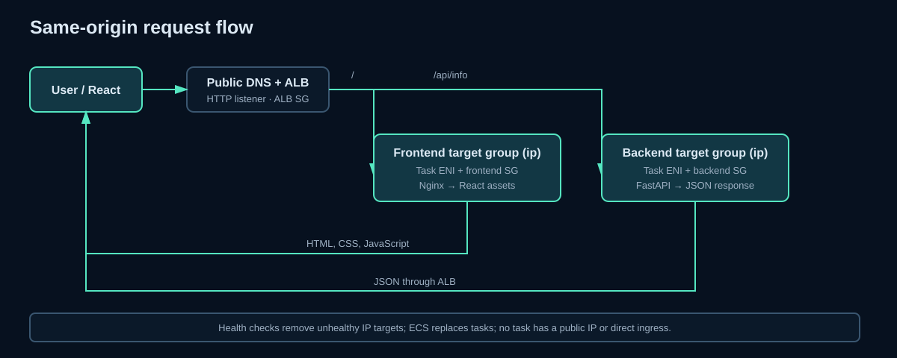

# Request flow

Frontend: user → public ALB DNS → internet-facing ALB/SG → HTTP listener → default action → frontend `ip` target group → private task ENI/SG → Nginx → React assets → ALB response.

API: React relative request `/api/info` → same ALB → `/api/*` listener rule → backend `ip` target group → private task ENI/SG → FastAPI → JSON response through the ALB. Nginx does not proxy API traffic.

ALB health checks call `/health` and `/api/health`. ECS registers task ENIs because target type is `ip`; unhealthy targets leave rotation and the deployment circuit breaker can replace/roll back tasks. Each service scales independently. No task has a public address or accepts direct internet traffic.

